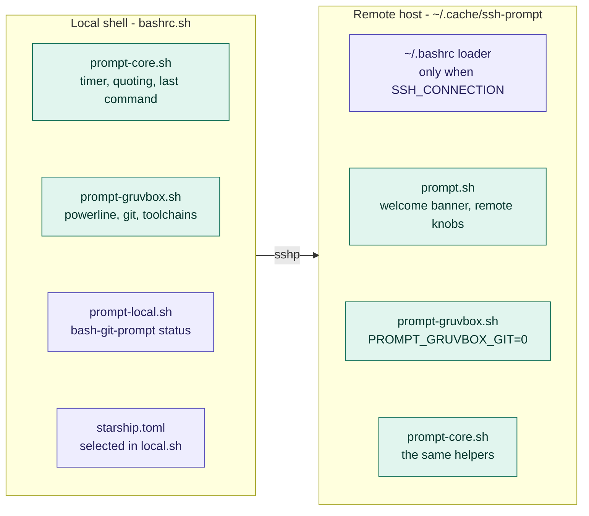

# Architecture and internals

## Load order

```
~/.bashrc                       (generated by install.sh)
  └─ bashrc.sh                  returns immediately unless interactive
       ├─ exports BASH_CONFIG_ROOT
       ├─ bashrc.d/environment.sh    JDK / JMeter / Android / Maven
       ├─ bashrc.d/prompt-core.sh    command timer, window title helpers
       ├─ bashrc.d/history.sh        history sizes, timestamps, dedup, history -a
       ├─ bashrc.d/listing.sh        ll, TIME_STYLE
       ├─ bashrc.d/ssh-tools.sh      ┐
       │    ├─ lib/ssh-config.sh     │
       │    ├─ lib/known-hosts.sh    │ libraries
       │    ├─ lib/ssh-by-number.sh  │
       │    ├─ lib/ssh-resolve-ips.sh│
       │    ├─ lib/ssh-resolve-hosts.sh┘
       │    ├─ commands.sh          bash-commands
       │    ├─ completions/*.bash
       │    └─ aliases + complete registrations
       ├─ ssh-prompt.sh              sshp
       ├─ local.sh                   optional, untracked; selects prompt backend
       └─ one local prompt backend
            ├─ starship.toml + starship init bash
            ├─ bashrc.d/prompt-local.sh   bash-git-prompt wiring
            └─ bashrc.d/prompt-gruvbox.sh pure-Bash Gruvbox Powerline
```

`bashrc.sh` guards on `[[ $- == *i* ]]`, so non-interactive shells (scripts,
`scp`, `rsync`) exit the file immediately.

`local.sh` is deliberately sourced before the local prompt backend. Its
`BASH_PROMPT_BACKEND` value chooses `starship`, `bash-git-prompt`, `gruvbox`, or
`auto`; only the selected backend is initialized in a fresh shell.

`sshp()` is defined in exactly one place, `ssh-prompt.sh`. It starts with
`unalias sshp`, because aliases are expanded before function lookup and would
otherwise shadow the function at the interactive prompt. `ssh` is deliberately
neither unaliased nor redefined: the configuration no longer wraps it, so plain
`ssh` is the OpenSSH client from `PATH`. The completion registrations for both
names live in `ssh-tools.sh`, which is loaded earlier — the order does not
matter there, since `complete -F` only stores a function name.

## Prompt modules, local and remote

`sshp` pushes the shared prompt modules to the remote host, which is why both
ends render the same prompt. `prompt.sh` is only the remote wiring around them —
welcome banner, remote defaults, and the fallback for a Bash older than 4.2.



Teal is synced by `sshp` — `listing.sh` travels along as well and is left out
here — purple exists at one end only. The boxes inside a subgraph are stacked,
not chained: they are modules, not steps. The remote differences are exactly
two: no Git segment, and `\u@\h` instead of `\u`.

## `PROMPT_COMMAND` composition

The shell prompt backends interleave with the shared history hook, and both
handle the string form and the Bash 5.1 array form of `PROMPT_COMMAND`. Starship
uses its own Bash initialization and is never combined with either shell prompt.

**Local** (`prompt-local.sh`), built in three steps:

```
1. prepend  __cmd_timer_stop      capture $? and duration first
2. source   gitprompt.sh          bash-git-prompt inserts its own entry
3. append   __cmd_timer_arm       re-arm the DEBUG trap last
```

`history.sh` is sourced before both prompt modules and appends
`__history_append` to whatever `PROMPT_COMMAND` holds at that point. Step 1
above prepends to it rather than replacing it, so the history entry survives and
ends up in the middle.

Result, roughly: `__cmd_timer_stop` → `__history_append` →
`setLastCommandState`/git prompt builder → `__cmd_timer_arm`. `prompt_callback` is not in `PROMPT_COMMAND` at all;
`bash-git-prompt` calls it while assembling the prompt.

**Remote** (`prompt.sh`) replaces `PROMPT_COMMAND` outright. It sources
`prompt-gruvbox.sh` with `PROMPT_GRUVBOX_GIT=0`, so the remote prompt is the
local powerline prompt minus the Git segment:

```
__cmd_timer_stop → __gb_build → __cmd_timer_arm
```

On a Bash older than 4.2 the associative arrays in `prompt-gruvbox.sh` are not
available, and `prompt.sh` falls back to its own plain builder:

```
__cmd_timer_stop → __remote_prompt_build → __cmd_timer_arm
```

The `DEBUG` trap is set and cleared once per command line:
`__cmd_timer_arm` installs it, `__cmd_timer_debug` immediately removes it after
recording the command, and `__cmd_timer_stop` removes it again defensively. This
keeps the trap from firing for each function call inside a pipeline.

## Naming conventions

| Prefix | Meaning |
|---|---|
| `__cmd_*` | Command timer and window title |
| `__prompt_*` | Shared prompt text helpers (quoting, last-command repetition) |
| `__history_*` | History writing and duplicate detection |
| `__remote_prompt_*` | Remote prompt only |
| `__kh_scan_*` | Shared SSH-config scanner results |
| `__kh_rows`, `__kh_target_*`, `__kh_cache_*` | `known-hosts` cache |
| `__kh_group_*` | The shared grouping model behind `known-hosts` and `ssh-nr` |
| `__kh_clean_*` | `known-hosts --clean` state |
| `__ssh_completion_*` | Shared completion cache and helpers |
| `__ssh_resolve_ips_*` | `ssh-resolve-ips` internals, IP predicates and PTR cache |
| `__ssh_resolve_hosts_*` | `ssh-resolve-hosts` internals and forward-DNS cache |
| `__ssh_tools_dir` | Loader-local path helper in `ssh-tools.sh`, unset again at the end |
| `__sshp_*` | Shared `ssh`/`sshp` argument parser, option tables and help |
| `__bash_commands_*` | `bash-commands` helpers: kind lookup and usage text |
| `_ssh_*_completion` | Functions registered with `complete -F` |
| `ssh_known_hosts`, `ssh_by_number`, … | Public functions behind the hyphenated aliases |

Public commands are exposed as hyphenated aliases (`known-hosts`) pointing at
underscore function names (`ssh_known_hosts`), and completion is registered for
both spellings.

## The shared config scanner — `lib/ssh-config.sh`

One scanner feeds `known-hosts`, `--clean`, `ssh-resolve-ips` and the
completion cache. `__kh_scan_configs` resets state, scans the user config with
`$HOME/.ssh` as the include base, then `/etc/ssh/ssh_config`.

`__kh_scan_file` reads a config file line by line in pure Bash:

- strips `\r` (CRLF configs from Windows) and `#` comments, and normalises a
  single `=` to a space;
- lowercases the keyword, so `HostName`, `hostname` and `HOSTNAME` are equal;
- collects only **concrete** `Host` tokens — anything containing `*`, `?`, `!`,
  whitespace or control characters, or starting with `-`, is skipped;
- follows `Include` recursively, supporting `~/`, absolute paths, paths relative
  to the include base, and globs expanded with the `compgen -G` builtin;
- refuses to evaluate tokens containing `%` or `$`, since expanding them would
  require guessing OpenSSH's substitution semantics;
- guards against include loops via a per-file "seen" map.

Results land in these arrays and maps:

| Name | Contents |
|---|---|
| `__kh_scan_aliases` | Concrete host aliases, in file order |
| `__kh_scan_files` | Every config file actually read |
| `__kh_scan_include_patterns` | Include globs, for cache validation |
| `__kh_scan_alias_direct_user` | Alias → `User`, only from concrete `Host` blocks |
| `__kh_scan_target_direct_user` | Literal `HostName` → `User`, same restriction |

The "direct user" maps deliberately exclude `Host *`, wildcard blocks and
`Match` blocks. That is what lets `known-hosts` distinguish an explicitly
configured user from an inherited one and colour it accordingly.

## The grouping model — `lib/known-hosts.sh`

`known-hosts` and `ssh-nr` share one model so their numbering can never
disagree.

`__kh_refresh` builds the raw mapping:

1. For each concrete alias, `ssh -G -T` resolves `HostName`, `User`, `Port` and
   `HostKeyAlias`.
2. The `known_hosts` lookup key is derived: `HostKeyAlias` if set and not
   `none`, else `HostName`; wrapped as `[key]:port` when the port is not 22.
3. `ssh-keygen -F <key> -f <known_hosts>` reports the matching line numbers,
   parsed out of its `# … line N` comments. Exit code 1 (no match) is tolerated;
   anything higher aborts.
4. `__kh_rows[<line>]` accumulates tab-separated
   `alias, user, lookup, user_explicit` records.
5. A second pass over `known_hosts` handles lines with no alias mapping and
   resolves their effective user via `ssh -G` on the raw host, so `Host *`
   defaults still show up. The host itself is not presented as an alias.

`__kh_groups_build` then aggregates into parallel arrays
`__kh_group_alias`, `__kh_group_target`, `__kh_group_user`,
`__kh_group_user_explicit`, `__kh_group_lines` and `__kh_group_keys`, keyed
internally by `alias/target/user` (or `marker/hosts` for unmapped entries). The
array index plus one is the `NR` column, which makes the number stable for a
given file state — but it will shift if you add or remove `known_hosts` lines or
config aliases.

### Caching

| Cache | Invalidated when |
|---|---|
| `known-hosts` (`__kh_cache_id`, `__kh_rows`) | The `known_hosts`/config pair changes, or the stored copy of the `known_hosts` contents differs |
| Completion (`__ssh_completion_*`) | `known_hosts`, the user config, `/etc/ssh/ssh_config`, any included file, or any include glob's match list changes |
| PTR DNS (`__ssh_resolve_ips_dns_cache`) | Only on `--refresh` or `known-hosts --refresh`; negative results are cached with a `\x1e` sentinel |
| Forward DNS (`__ssh_resolve_hosts_dns_cache`) | Same, for `ssh-resolve-hosts` |
| Endpoint reachability (`__kh_clean_endpoint_*`) | Per `known-hosts --clean` invocation |

Validation uses only Bash builtins (`$(< file)`, `compgen -G`), so pressing
`TAB` does not fork processes just to decide whether the cache is still good.
`known-hosts --refresh` clears the first four at once.

## Testing

```bash
bash tests/run-all.sh       # everything
bash tests/history.sh       # a single script
```

`tests/run-all.sh` executes every `*.sh` in `tests/` except itself and
`lib.sh`, prints one `PASS` line per script with its check count, and returns
`1` if any script failed.

| Script | Checks | Covers |
|---|---|---|
| `tests/install.sh` | 21 | The generated loader, the backup, `printf %q` quoting of a path with spaces, the `bash -n` gate, and that `bashrc.sh` stays inert in a non-interactive shell |
| `tests/history.sh` | 17 | `history_dedupe` on timestamped, multi-line and timestamp-less files, plus the live rewrite and `HISTORY_DEDUPE_LIVE=0` end to end in an interactive shell |
| `tests/listing.sh` | 17 | The `ll` header, the dropped `ls` summary line, hidden files, names with spaces, option pass-through |
| `tests/prompt-core.sh` | 22 | The clock, duration formatting across all five ranges, exit-code capture, control-character escaping in the window title |
| `tests/ssh-config.sh` | 22 | Alias collection, skipped wildcards, quotes, `Include` with glob and `~/`, direct versus inherited users |
| `tests/known-hosts.sh` | 13 | The `known_hosts` parser, the filter, hashed and marker entries, rejected option combinations, and how many processes the rendering spawns |
| `tests/known-hosts-clean.sh` | 39 | `known-hosts --clean`: dry run, `--apply` with backups, rejected combinations, the removed `known-hosts-clean` alias, and the completion |
| `tests/ssh-by-number.sh` | 19 | `ssh-nr`: help, `--list`, invalid and out-of-range numbers, alias versus raw target, `[host]:port`, markers, `-F` pass-through, both `sshp` call branches |
| `tests/ssh-resolve.sh` | 38 | The IPv4/IPv6 predicates, help, argument and timeout validation, and the load-order dependency between the two resolvers |
| `tests/sshp.sh` | 34 | The `sshp` argument parser, `--force`, `--`, the remote-command rejection, and the check for missing sync files |
| `tests/commands.sh` | 26 | `bash-commands`: listing, `--details`, the `--check` self-test including a deliberately stale row, filter, rejected combinations |
| `tests/completion.sh` | 27 | The shared host cache, its invalidation after a config edit, `ssh`/`sshp` destinations including `user@`, and every per-command completion |

`tests/lib.sh` holds the shared parts: `assert`, `assert_equal`,
`assert_contains`, `assert_not_contains`, `assert_status`, `assert_file`, and
`test_sandbox`/`test_stub`.

`test_sandbox` creates a temporary `HOME` plus a stub directory at the front of
`PATH` and removes both on exit, so no test sees your real `~/.ssh` or
`~/.bash_history`. `test_stub` writes an executable stub into that directory,
which is necessary because the configuration calls `ssh`, `ssh-keygen` and
`ssh-keyscan` through `command`, where a shell function would be ignored. No
test opens a network connection.

The tests deliberately do not use `set -e`. They source the real configuration,
and several of its functions return non-zero as part of normal control flow — an
unreachable host, a rejected option combination — which would abort an errexit
shell mid-test. Each assertion exits on its own instead.

`tests/known_hosts.fixture` contains three synthetic lines — a plaintext host
with an extra `[host]:2222` name, a `@cert-authority` wildcard entry, and a
hashed entry — and deliberately **no valid cryptographic keys**. These are
parser and behaviour regression tests, not crypto tests and not benchmarks.

`bash-commands --check` is a second, cheap self-test: it resolves every command
listed in `bashrc.d/commands.sh` and returns exit code `1` if one is missing, so
a renamed alias does not silently invalidate the overview.

To syntax-check everything, including the files `install.sh` skips:

```bash
find . -name '*.sh' -o -name '*.bash' | xargs -n1 bash -n
```

`TEST.md` in the repository root lists what the automated suite covers and
reports the manual test run covering the installer, the local and remote prompts, the
`ll` layout, multi-file sync with a stubbed `ssh` client, per-target change
detection, and the `known-hosts` overview. It also lists what could not be
tested automatically: Git Bash on Windows, a real `bash-git-prompt` install,
real target servers, terminal colour and Unicode rendering, password-based
logins, and GNU `ls` option availability on every target.

## Known limitations

### 1. `sshp` opens interactive logins only

`sshp` forwards OpenSSH options but rejects anything after the destination,
because it always ends in an interactive login — syncing a prompt for
`host uname -a` would be pointless. Use `ssh host uname -a` for that: `ssh` is
not wrapped, so anything that is not an interactive login simply goes to
OpenSSH directly. The flip side is that a plain `ssh host` no longer syncs the
prompt either; call `sshp host` when you want it.

The sync state is keyed by the destination string alone. `sshp web01` and
`sshp -F other-config web01` share one state entry, so if two configs map the
same alias to different machines, use `--force`.

> Earlier versions shipped a second wrapper layer in `bashrc.d/lib/ssh-command.sh`
> (the file itself has since been deleted as well)
> that added `-q` by default plus `--banner`/`--no-quiet`/`--quiet` and
> `SSH_TOOLS_QUIET`. Because `ssh-prompt.sh` is sourced later and redefines
> `ssh()`/`sshp()`, that layer was never active. It has been removed together
> with its switches and their completions; option handling now lives in `sshp`
> itself.
>
> The `ssh()` wrapper in `ssh-prompt.sh` is gone as well. It routed plain
> logins to `sshp` and everything else to native OpenSSH. `ssh` is now the
> unmodified system binary; the prompt sync is only performed by an explicit
> `sshp` (or `ssh-nr`, which calls `sshp`).

### 2. `bashrc.d/environment.sh` is machine-specific

Hard-coded Windows paths for JDK, JMeter, the Android SDK and Maven, in a
versioned file. Adapt it or move your values to `local.sh`; see
[configuration.md](configuration.md#bashrcdenvironmentsh). `PATH` is also
prepended unconditionally, so re-sourcing accumulates duplicate entries.

### 3. `install.sh` checks only part of the tree

`bash -n` is run against `bashrc.sh`, `prompt.sh`, `ssh-prompt.sh`,
`.git-prompt-colors.sh` and the seven `bashrc.d/*.sh` modules — but not
`bashrc.d/lib/*.sh` or `bashrc.d/completions/*.bash`. A syntax error there is
only noticed when a new shell starts. Run the `find | xargs bash -n` command
above before committing.

### 4. `bashrc.snippet.sh` is out of date

It describes a `~/.config/bash/ssh-prompt/` layout and references a
`PROMPT_SYNC_FILE` variable that no code reads. It is a historical reference
file; use `install.sh`.

### 5. English UI and documentation

All user-visible strings, column headers (`TARGET`, `USER`, `KEYS`, `PERMS`,
`MODIFIED`), usage texts and the remote prompt's `last:` label are English. The
project used to ship a German UI; if you rely on the former German option
synonym `--zeilen` for `known-hosts`, note that it has been removed in favour of
`--lines`.

### 6. GNU tooling assumptions

`ll` parses GNU `ls` output positionally and uses `-o`,
`--group-directories-first` and `--time-style`; BusyBox and BSD `ls` will
produce misaligned output. `--group-directories-first` in particular is
GNU-only.

### 7. `ssh -G` and `Match exec`

`known-hosts` (including `--clean`), `ssh-resolve-ips` and `ssh-resolve-hosts`
call `ssh -G` per alias. That opens no network connection, but it does evaluate `Match exec`
rules in your config — so those commands can trigger arbitrary local commands
you configured yourself. It is also the main cost driver: a config with many
aliases means many `ssh -G` invocations on the first (uncached) call.

### 8. `known-hosts --clean` cannot distinguish down from gone

An unreachable host is treated as stale. Running `--apply` off the VPN or during
maintenance will remove valid entries. Always read the dry run, and raise
`SSH_KNOWN_HOSTS_CLEAN_TIMEOUT` on slow links.

### 9. Hashed `known_hosts` entries are opaque

With `HashKnownHosts` enabled the hostname cannot be recovered. Such entries are
shown as `[hashed hostname]`, cannot be filtered by name, cannot be reached
via `ssh-nr`, and are skipped by `--clean`, `ssh-resolve-ips` and
`ssh-resolve-hosts`.

### 10. `NR` is only stable per file state

Target numbers come from the position in the grouping model. Adding or removing
`known_hosts` lines or config aliases renumbers targets. Re-run `known-hosts`
before using `ssh-nr` if the files may have changed.

### 11. `sshp` modifies the remote home directory

It appends a block to the remote `~/.bashrc` and creates `~/.hushlogin`. Both
are guarded and reversible, but on shared or managed accounts you may not want
this. Undo instructions are in
[installation.md](installation.md#what-sshp-changes-on-a-remote-host).

### 12. History deduplication is unlocked and file-wide

`history_dedupe` reads and rewrites the whole history file. Two shells that
start at the very same moment, or a rewrite that races an append from another
terminal, can lose a single line; there is no portable locking under Git Bash.
The cost also scales with the file, which is why `HISTFILESIZE` was lowered to
`200000` and why the in-session rewrite is limited to actual repeats and can be
turned off with `HISTORY_DEDUPE_LIVE=0`.

`HISTCONTROL` never applies to entries read from the file, only to commands
typed at the prompt. Duplicates created by another terminal are therefore
visible until the next shell start cleans the file.

## Extension points

**Adding a test** — drop a `*.sh` into `tests/`, source `tests/lib.sh`, call
`test_sandbox` before sourcing anything from the configuration, and end with
`pass`. `tests/run-all.sh` picks it up automatically.

**Adding a shell module** — drop a file into `bashrc.d/` and add a `source`
line to `bashrc.sh`. Files sourced by both local and remote shells must stay
free of local paths, Windows assumptions and `bash-git-prompt` dependencies.

**Adding a file to the remote sync** — extend the `sync_files` array in
`ssh-prompt.sh`, add a `bash -n` check for it in the remote heredoc, and bump
`sshp-sync-format=5` so every stored state invalidates and all hosts re-sync.

**Adding an SSH helper** — put the function in `bashrc.d/lib/`, its completion
in `bashrc.d/completions/`, then add the `source` lines, the alias and the
`complete -F` registration in `bashrc.d/ssh-tools.sh`. Reuse `__kh_scan_configs`
for config parsing and `__ssh_completion_cache_ensure` for host lists rather
than re-implementing either. Finally add a row to the `rows` table in
`bashrc.d/commands.sh` and the name to `bashrc.d/completions/commands.bash`,
then confirm with `bash-commands --check`.

**Changing the prompt** — the powerline prompt lives in `prompt-gruvbox.sh` and
is shared by local and remote shells; `bash-git-prompt` theming lives in
`.git-prompt-colors.sh` and `prompt-local.sh`; the remote wiring, the welcome
banner and the pre-4.2 fallback live in `prompt.sh`. Keep the timer variable
names (`__cmd_last_exit`, `__cmd_duration`, `__cmd_elapsed_us`) intact, since
both prompts read them.
