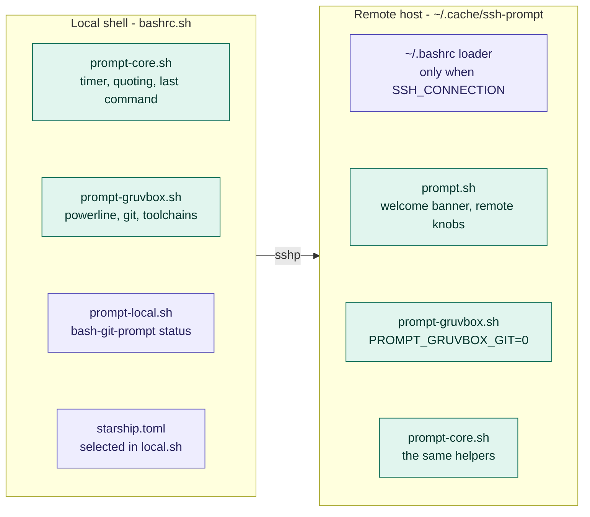

# Architecture and internals

## Load order

```
~/.bashrc                       (generated by install.sh)
  └─ bashrc.sh                  returns immediately unless interactive
       ├─ exports BASH_CONFIG_ROOT
       ├─ bashrc.d/environment.sh    empty hook for machine-specific exports
       ├─ local.sh                   optional, untracked; source-time overrides
       ├─ bashrc.d/prompt-core.sh    command timer, window title helpers
       ├─ bashrc.d/history.sh        history sizes, timestamps, dedup, history -a
       ├─ bashrc.d/listing.sh        ll, TIME_STYLE
       ├─ bashrc.d/ssh-tools.sh      ┐
       │    ├─ lib/options.sh        │ shared FILTER/option conventions
       │    ├─ lib/ssh-config.sh     │ scanner + shared SSH inventory/cache
       │    ├─ lib/known-hosts.sh    │ cache, grouping model, display
       │    ├─ lib/known-hosts-clean.sh│ --clean
       │    ├─ lib/ssh-by-number.sh  │ ssh-nr
       │    ├─ lib/ssh-resolve.sh    │ shared resolver table
       │    ├─ lib/ssh-resolve-ips.sh│ reverse direction
       │    ├─ lib/ssh-resolve-hosts.sh┘ forward direction
       │    ├─ commands.sh          bash-commands
       │    ├─ completions/*.bash
       │    └─ aliases + complete registrations
       ├─ ssh-prompt.sh              sshp
       └─ one local prompt backend
            ├─ starship.toml + starship init bash
            ├─ bashrc.d/prompt-local.sh   bash-git-prompt wiring
            └─ bashrc.d/prompt-gruvbox.sh pure-Bash Gruvbox Powerline
```

`bashrc.sh` guards on `[[ $- == *i* ]]`, so non-interactive shells (scripts,
`scp`, `rsync`) exit the file immediately.

`local.sh` is deliberately sourced immediately after `environment.sh`, before
modules that consume configuration at source time. Its `BASH_PROMPT_BACKEND`
value still chooses `starship`, `bash-git-prompt`, `gruvbox`, or `auto`; history
settings such as `HISTORY_DEDUPE_ON_START` now take effect before `history.sh`
initializes.

`sshp()` is defined in exactly one place, `ssh-prompt.sh`. It starts with
`unalias sshp`, because aliases are expanded before function lookup and would
otherwise shadow the function at the interactive prompt. `ssh` is deliberately
neither unaliased nor redefined: the configuration no longer wraps it, so plain
`ssh` is the OpenSSH client from `PATH`. The completion registrations for both
names live in `ssh-tools.sh`, which is loaded earlier — the order does not
matter there, since `complete -F` only stores a function name.


The same module owns the sync-status lifecycle. On a cache miss it starts a
TTY-only ASCII spinner and advances it across archive creation, remote install
and state persistence. The status process is stopped by the same local cleanup
path on normal completion and signals; cache hits never start it. This keeps
progress reporting coupled to the sync transaction without leaking terminal
behaviour into the remote script.

## Prompt modules, local and remote

`sshp` pushes the shared prompt modules to the remote host, which is why both
ends render the same prompt. `prompt.sh` is only the remote wiring around them —
welcome banner, remote defaults, and the fallback for a Bash older than 4.2.



Teal is synced by `sshp` — `listing.sh` travels along as well and is left out
here — purple exists at one end only. The boxes inside a subgraph are stacked,
not chained: they are modules, not steps. The remote differences are exactly
two: no Git segment, and `\u@\h` instead of `\u`.

## `PROMPT_COMMAND` composition

`bashrc.d/prompt-core.sh` is the single owner of prompt-hook composition. Prompt
modules no longer edit `PROMPT_COMMAND` directly; they use three helpers that
preserve whichever representation is already active (the traditional string or
the Bash 5.1+ array form):

- `__prompt_command_prepend HOOK...` inserts hooks before the current list.
- `__prompt_command_append HOOK...` inserts hooks after the current list.
- `__prompt_command_replace HOOK...` replaces the list; with no arguments it
  clears it while retaining the current representation.

This keeps ordering policy separate from backend code and avoids each module
reimplementing string/array handling.

**Local history** uses `__prompt_command_append __history_append`, so subsequent
prompt backends can compose around it without losing per-command history
persistence.

**Local bash-git-prompt** is built in three steps:

```
1. prepend  __cmd_timer_stop      capture $? and duration first
2. source   gitprompt.sh          bash-git-prompt inserts its own entry
3. append   __cmd_timer_arm       re-arm the DEBUG trap last
```

Result, roughly: `__cmd_timer_stop` → `__history_append` →
`setLastCommandState`/git prompt builder → `__cmd_timer_arm`. `prompt_callback`
is not in `PROMPT_COMMAND`; `bash-git-prompt` calls it while assembling the
prompt.

**Local Gruvbox** follows the same contract: prepend `__cmd_timer_stop`, retain
all existing hooks (including `__history_append`), then append `__gb_build` and
`__cmd_timer_arm`.

**Remote** (`prompt.sh`) deliberately starts with
`__prompt_command_replace`, because server-local prompt hooks must not alter the
sshp prompt. It then installs the fixed sequence
`__cmd_timer_stop` → `__gb_build` → `__cmd_timer_arm`. On Bash older than 4.2,
the same replacement helper installs
`__cmd_timer_stop` → `__remote_prompt_build` → `__cmd_timer_arm`.

The `DEBUG` trap remains owned directly by `prompt-core.sh`: `__cmd_timer_arm`
installs it, `__cmd_timer_debug` removes it after the first command event, and
`__cmd_timer_stop` removes it defensively. It is intentionally not wrapped in a
generic helper function: Bash gives `DEBUG` trap changes made inside ordinary
functions function-local semantics unless `functrace` is enabled, and enabling
that globally would change trap propagation and prompt overhead.

## Naming conventions

| Prefix | Meaning |
|---|---|
| `__cmd_*` | Command timer and window title |
| `__prompt_*` | Shared prompt text helpers (quoting, last-command repetition) |
| `__history_*` | History writing and duplicate detection |
| `__remote_prompt_*` | Remote prompt only |
| `__kh_scan_*` | Shared SSH-config scanner results |
| `__kh_line_*`, `__kh_host`, `__kh_port` | Results of the shared `known_hosts` line parser |
| `__kh_parse_*`, `__kh_split_*`, `__kh_ssh_config_*`, `__kh_lookup_key` | Shared primitives in `lib/ssh-config.sh` |
| `__kh_rows`, `__kh_target_*`, `__kh_cache_*` | `known-hosts` cache |
| `__kh_group_*` | The shared grouping model behind `known-hosts` and `ssh-nr` |
| `__kh_clean_*` | `known-hosts --clean` state |
| `__ssh_inventory_*` | Shared config/known_hosts snapshots, invalidation generation and cached `ssh -G` results |
| `__ssh_cache_*` | The invalidation registry every cache-owning module registers with |
| `__ssh_completion_*` | Completion-specific host/user lists derived from the shared inventory |
| `__opt_*` | Shared option-parsing conventions in `lib/options.sh` |
| `__ssh_resolve_*` | Shared resolver machinery: IP predicates, accumulators, the backend chain, `__ssh_resolve_table` |
| `__ssh_resolve_ips_*` | `ssh-resolve-ips` only: PTR cache, extractor, lookup |
| `__ssh_resolve_hosts_*` | `ssh-resolve-hosts` only: forward-DNS cache, extractor, lookup |
| `resolve_*` (locals) | The spec a resolver hands to `__ssh_resolve_table` |
| `__ssh_tools_dir` | Loader-local path helper in `ssh-tools.sh`, unset again at the end |
| `__sshp_*` | Shared `ssh`/`sshp` argument parser, option tables and help |
| `__bash_commands_*` | `bash-commands` helpers: kind lookup and usage text |
| `_ssh_*_completion` | Functions registered with `complete -F` |
| `ssh_known_hosts`, `ssh_by_number`, … | Public functions behind the hyphenated aliases |

Public commands are exposed as hyphenated aliases (`known-hosts`) pointing at
underscore function names (`ssh_known_hosts`), and completion is registered for
both spellings.

## The shared SSH inventory — `lib/ssh-config.sh`

One scanner feeds the shared inventory used by `known-hosts`, both resolvers
and completion. `__kh_scan_configs` remains the low-level scanner;
`__ssh_inventory_ensure` wraps it in one content-based cache over the user
config, `/etc/ssh/ssh_config`, every included file, every Include glob and
`known_hosts`.

`__kh_scan_file` reads a config file line by line in pure Bash. How a line is
spelled is not its business: it hands every line to `__kh_parse_config_line`
(see below), which strips `\r` from CRLF configs and `#` comments, normalises a
single `=` to a space, lowercases the keyword so `HostName`, `hostname` and
`HOSTNAME` are equal, and unquotes the tokens. What the scanner adds on top:

- collects only **concrete** `Host` tokens — anything containing `*`, `?`, `!`,
  whitespace or control characters, or starting with `-`, is skipped;
- follows `Include` recursively, supporting `~/`, absolute paths, paths relative
  to the include base, and globs expanded with the `compgen -G` builtin;
- refuses to evaluate tokens containing `%` or `$`, since expanding them would
  require guessing OpenSSH's substitution semantics;
- guards against include loops via a per-file "seen" map.

Results land in these arrays and maps:

| Name | Contents |
|---|---|
| `__kh_scan_aliases` | Concrete host aliases, in file order |
| `__kh_scan_files` | Every config file actually read |
| `__kh_scan_include_patterns` | Include globs, for cache validation |
| `__kh_scan_alias_direct_user` | Alias → `User`, only from concrete `Host` blocks |
| `__kh_scan_target_direct_user` | Literal `HostName` → `User`, same restriction |

The "direct user" maps deliberately exclude `Host *`, wildcard blocks and
`Match` blocks. That is what lets `known-hosts` distinguish an explicitly
configured user from an inherited one and colour it accordingly.

The inventory exposes separate user-only and combined views (`__ssh_inventory_user_*`
and `__ssh_inventory_*`). Successful and failed `ssh -G` evaluations are cached
per target for the current inventory generation, so completion, `known-hosts`
and the resolvers do not repeat the same resolution work. A change to any
watched file or Include-glob match creates a new generation and drops those
resolved-target entries automatically.

### Shared primitives in the same file

Reading a `known_hosts` line, tokenizing an `ssh_config` line and asking
`ssh -G` about a target used to be copy-pasted into every command that needed
them: `known-hosts` twice, the grouping model, `--clean` three times, both
resolvers, and — for the config line syntax — `__kh_scan_file` and
`__ssh_resolve_table` in parallel. They now live next
to the scanner, so a parser fix lands everywhere at once and CRLF files,
marker entries and hashed entries behave identically in every command.

| Function | Purpose |
|---|---|
| `__kh_parse_config_line LINE` | Tokenizes one `ssh_config` line into `__kh_config_keyword` (lowercased) and `__kh_config_words` (keyword plus unquoted arguments, read as `[@]:1`). Strips `\r` and `#` comments and normalises the first `=` to a space. Returns `1` for blank and comment-only lines, so callers can `\|\| continue` |
| `__kh_parse_known_line LINE` | Splits a line into `__kh_line_marker`, `__kh_line_hosts`, `__kh_line_keytype`, `__kh_line_key` and `__kh_line_hashed`. Strips `\r`. Returns `1` for comments, blank lines and lines without a host field, so callers can `|| continue` |
| `__kh_split_host_port TOKEN` | Unwraps `[host]:port` into `__kh_host` and `__kh_port`; a bare token yields port `22` |
| `__kh_ssh_config_dump CONFIG TARGET [QUIET]` | Runs `ssh -G -T` into `REPLY`, adding `-F` only for a non-default config path. `QUIET=1` discards stderr for callers that treat a failure as "skip" |
| `__kh_ssh_config_field DUMP FIELD` | Reads one keyword out of such a dump into `REPLY` |
| `__kh_lookup_key HOSTNAME HOSTKEYALIAS PORT` | Derives the `known_hosts` lookup name into `REPLY`: `HostKeyAlias` unless unset or `none`, wrapped as `[key]:port` for a non-default port |

## The grouping model — `lib/known-hosts.sh`

`known-hosts` and `ssh-nr` share one model so their numbering can never
disagree.

`__kh_refresh` builds the raw mapping:

1. For each concrete alias, `ssh -G -T` resolves `HostName`, `User`, `Port` and
   `HostKeyAlias`.
2. The `known_hosts` lookup key is derived: `HostKeyAlias` if set and not
   `none`, else `HostName`; wrapped as `[key]:port` when the port is not 22.
3. `ssh-keygen -F <key> -f <known_hosts>` reports the matching line numbers,
   parsed out of its `# … line N` comments. Exit code 1 (no match) is tolerated;
   anything higher aborts.
4. `__kh_rows[<line>]` accumulates tab-separated
   `alias, user, lookup, user_explicit` records.
5. A second pass over `known_hosts` handles lines with no alias mapping and
   resolves their effective user via `ssh -G` on the raw host, so `Host *`
   defaults still show up. The host itself is not presented as an alias.

`__kh_groups_build` then aggregates into parallel arrays
`__kh_group_alias`, `__kh_group_target`, `__kh_group_user`,
`__kh_group_user_explicit`, `__kh_group_lines` and `__kh_group_keys`, keyed
internally by `alias/target/user` (or `marker/hosts` for unmapped entries). The
array index plus one is the `NR` column, which makes the number stable for a
given file state — but it will shift if you add or remove `known_hosts` lines or
config aliases.

### Caching

| Cache | Invalidated when |
|---|---|
| Shared SSH inventory (`__ssh_inventory_*`) | `known_hosts`, the user config, `/etc/ssh/ssh_config`, any included file, or any Include glob's match list changes; also explicit `known-hosts --refresh` |
| `known-hosts` rows/groups | The shared inventory generation changes |
| Completion host/user lists (`__ssh_completion_*`) | The shared inventory generation changes |
| PTR DNS (`__ssh_resolve_ips_dns_cache`) | Only on `ssh-resolve-ips --refresh` or the sweep below; negative results are cached with a `\x1e` sentinel |
| Forward DNS (`__ssh_resolve_hosts_dns_cache`) | Same, for `ssh-resolve-hosts` |
| Endpoint reachability (`__kh_clean_endpoint_*`) | Per `known-hosts --clean` invocation |

Validation uses only Bash builtins (`$(< file)`, `compgen -G`), so pressing
`TAB` does not fork processes just to decide whether the inventory is still
current.

#### The invalidation registry

`known-hosts --refresh` and a successful `known-hosts --clean --apply` drop
every cache above. They do not name them: a module registers its own
invalidator with `__ssh_cache_register_invalidator` next to the function, and
both call sites run `__ssh_cache_invalidate_all`.

The registry lives in `lib/ssh-config.sh` and keeps insertion order, which
`ssh-tools.sh`'s source order makes meaningful — the inventory is registered
first and therefore dropped before the caches derived from it. Registering a
name twice is a no-op, so re-sourcing a module is harmless, and a registered
function that is not defined is skipped rather than fatal, so a test that
sources a single library still works.

This replaces two hand-maintained lists inside `ssh_known_hosts` that had
drifted apart: `--refresh` dropped the DNS caches, `--apply` did not, and one
guarded `__ssh_completion_cache_invalidate` while the other called it bare. A
new cache now needs one registration line in the module that owns it and no
edit to `known-hosts` at all.

## The shared resolver table — `lib/ssh-resolve.sh`

`ssh-resolve-ips` and `ssh-resolve-hosts` differ in exactly three things:
which tokens count as a key, which direction they ask DNS, and what the two
leading columns are called. Everything else — option handling, inventory
consumption, deduplication, the filter, the column widths and the output — is
`__ssh_resolve_table`. The table reads the user-config subset and `known_hosts`
from the shared inventory instead of rescanning files itself, and tokenizes the
config lines it does read with `__kh_parse_config_line`, the same parser the
scanner uses, so the two can never disagree about what a line says.

A command configures it by setting locals before the call; Bash's dynamic
scoping makes them visible inside:

| Local | Meaning |
|---|---|
| `resolve_command` | User-visible name, used in usage and error messages |
| `resolve_extract` | Function: token → key on stdout, `1` to skip the token |
| `resolve_lookup` | Function: key, timeout → `0` plus the variable named by `resolve_result` |
| `resolve_result` | Name of that variable |
| `resolve_invalidate` | Function clearing the DNS cache, for `--refresh` |
| `resolve_timeout_var` | Name of the timeout environment variable, for `--help` |
| `resolve_help` | Array of description lines for `--help` |
| `resolve_key_header`, `resolve_value_header` | Headers of the first two columns; their length is also the minimum width |
| `resolve_noun` | Plural used in the "nothing found" messages |
| `resolve_scan_host_tokens` | `1` to also read keys out of `Host` tokens. `ssh-resolve-ips` wants IP literals used as patterns; for `ssh-resolve-hosts` a `Host` token is an alias, whose effective `HostName` the `ssh -G` pass already covers |

The accumulators `__ssh_resolve_add_key`, `__ssh_resolve_add_config_ref` and
`__ssh_resolve_add_known_line` work on the caller's maps the same way. Both
commands guard at source time that `lib/ssh-resolve.sh` was loaded first.

### The DNS backend chain

Each resolver asks up to five external tools — `getent`, `dig`, `host`,
`powershell.exe`, `nslookup`, in that order — skipping the ones that are not
installed and taking the first non-empty answer. That skeleton is
`__ssh_resolve_backend_chain TIMEOUT KEY TOOL=FUNCTION ...`; the result lands
in `__ssh_resolve_backend_output`.

What is left in each resolver is one small function per tool, holding that
tool's command line and the `awk` program for its output format. A backend's
own failure is not fatal: an installed tool that errors out is treated like one
that said nothing. Before, the skeleton was written out five times per
direction, ten blocks differing only in the tool name.

PowerShell sits before `nslookup` because on Git Bash it is the one backend
that returns the hostname alone, and its CRLF output is stripped inside its own
function.

## Option conventions — `lib/options.sh`

`known-hosts` and `bash-commands` both take `[OPTIONS] [FILTER]` with at most
one positional filter and an optional `--` before it. `__opt_filter_set` and
`__opt_filter_separator` own that, including the wording of the error, and
assign the caller's `filter` local through dynamic scoping — the same
arrangement `__ssh_resolve_table` uses for its spec. `__opt_filter_separator`
reports in `__opt_filter_consumed` whether it took the word after `--`, so the
caller knows whether to shift.

The file has no dependencies and `ssh-tools.sh` sources it first.

## Testing

```bash
bash tests/run-all.sh       # everything
bash tests/history.sh       # a single script
```

`tests/run-all.sh` executes every `*.sh` in `tests/` except itself and
`lib.sh`, prints one `PASS` line per script with its check count, and returns
`1` if any script failed. Current state: 20 scripts, 745 checks, all passing.
The same suite runs in CI on every push, together with the `bash -n` gate over
the whole tree, `bash-commands --check` and ShellCheck; see
`.github/workflows/ci.yml`. ShellCheck is clean and blocking: every suppression
in the sources is a targeted `# shellcheck disable=` with its reason written
above it, so a new finding fails the build.

| Script | Checks | Covers |
|---|---|---|
| `tests/bashrc-integration.sh` | 4 | Full `bashrc.sh` composition: history survives all prompt backends and source-time settings are loaded before `history.sh` |
| `tests/commands.sh` | 38 | `bash-commands`: listing, `--details`, the `--check` self-test including a deliberately stale row, filter, rejected combinations |
| `tests/completion.sh` | 35 | Completion lists derived from the shared SSH inventory, invalidation after a config edit, `ssh`/`sshp` destinations including `user@`, every per-command completion, and the shared resolver registration |
| `tests/history.sh` | 26 | `history_dedupe`, serialized writers, stale-lock recovery, timestamped/multi-line/timestamp-less files, the shipped `HISTORY_DEDUPE_LIVE=0` default, live rewrite, and the `prompt-core.sh` guard |
| `tests/install.sh` | 30 | The generated loader, the backup, `printf %q` quoting of a path with spaces, the whole-tree `bash -n` gate including `lib/`, `completions/` and `local.sh`, and that `bashrc.sh` stays inert in a non-interactive shell |
| `tests/known-hosts-clean.sh` | 49 | `known-hosts --clean`: dry run, `--apply` with backups, the shared cache sweep after `--apply` and `--refresh`, rejected combinations, the removed `known-hosts-clean` alias, and the completion |
| `tests/known-hosts.sh` | 15 | The `known_hosts` parser, filter/process behaviour, and automatic invalidation after an SSH config edit |
| `tests/listing.sh` | 18 | The `ll` header, dropped summary line, hidden files, names with spaces, option pass-through and `ls` exit-status propagation |
| `tests/prompt-core.sh` | 40 | Central string/array `PROMPT_COMMAND` composition plus the clock, duration formatting, exit-code capture, shared text helpers, and window-title escaping |
| `tests/prompt-gruvbox.sh` | 62 | The pure-Bash Gruvbox prompt: palette, segment engine, Git segment, toolchain detection and the second powerline line |
| `tests/prompt-local.sh` | 19 | `prompt_callback`: order of duration, last command and exit code, quoting, the two repetition knobs, and the four performance switches |
| `tests/remote-prompt.sh` | 31 | `prompt.sh`: the pre-4.2 fallback builder and the remote Gruvbox wiring, including deliberate removal of inherited server `PROMPT_COMMAND` hooks |
| `tests/prompt-selection.sh` | 9 | The `local.sh` backend selector: Starship, `bash-git-prompt`, Gruvbox, and the fallback warnings |
| `tests/ssh-by-number.sh` | 19 | `ssh-nr`: help, `--list`, invalid and out-of-range numbers, alias versus raw target, `[host]:port`, markers, `-F` pass-through, both `sshp` call branches |
| `tests/ssh-config.sh` | 64 | The cache invalidation registry, the shared `ssh_config` line tokenizer, scanner behaviour, the shared config/known_hosts inventory, generation invalidation, Include-glob changes, cached `ssh -G`, and removed legacy completion files |
| `tests/ssh-resolve-backends.sh` | 75 | Every DNS backend of both resolvers against stubbed `getent`, `dig`, `host`, `nslookup` and `powershell.exe`: each tool's output format, the fallback order, the timeout wrapper, positive and negative caching, and the two token extractors |
| `tests/ssh-resolve-table.sh` | 34 | `__ssh_resolve_table` against a stubbed `ssh -G` and pre-seeded DNS caches: columns, merged references, bracketed IPv6, skipped hashed entries, filter, empty results, cache invalidation, and the full config line syntax reaching the CONFIG column |
| `tests/ssh-resolve.sh` | 56 | Strict IPv4/IPv6 predicates, compression/scoped/embedded-IPv4 cases, help, argument/timeout validation, and resolver source-time guards |
| `tests/sshp.sh` | 98 | The `sshp` parser, weak-crypto and sync-status policies, TTY-only spinner phases, silent cache hits, connection-aware cache identity, staged remote publication, preservation on validation failure, the remote syntax gate over every synced file, `--force`, `--`, remote-command rejection and missing sync files |
| `tests/starship-config.sh` | 23 | `starship.toml`: the removed helper script, the constant bg1 field on line one, the rounded caps on line two, and the palette matching `prompt-gruvbox.sh` |

The integration scripts stay separate from `run-all.sh` because they depend on
external runtimes or upstream projects:

- `tests/integration/bash-git-prompt.sh` runs against the pinned upstream
  `bash-git-prompt` 2.7.1 tree, verifies the performance switches survive
  initialization, and renders one prompt in a temporary Git repository.
- `tests/integration/starship.sh` runs against pinned Starship 1.26.0, renders
  `starship.toml` with the real binary, then loads the complete `bashrc.sh` and
  verifies Starship preserves the history hook while taking over
  `PROMPT_COMMAND`.
- `tests/integration/legacy-bash.sh` runs under Bash 3.2.57 and proves that
  `prompt.sh` itself parses and selects the pre-4.2 remote fallback without
  loading the associative-array Gruvbox implementation.

`.github/workflows/ci.yml` runs the regular suite on the current Ubuntu runner,
Git Bash on `windows-latest`, and the official Bash 4.2.53, 4.4.23, 5.1.16
and 5.3.20 container images. The Bash 3.2 job is deliberately limited to the
remote fallback because local shells require Bash 4.2 or newer.

`tests/lib.sh` holds the shared parts: `assert`, `assert_equal`,
`assert_contains`, `assert_not_contains`, `assert_status`, `assert_file`, and
`test_sandbox`/`test_stub`.

`test_sandbox` creates a temporary `HOME` plus a stub directory at the front of
`PATH` and removes both on exit, so no test sees your real `~/.ssh` or
`~/.bash_history`. `test_stub` writes an executable stub into that directory,
which is necessary because the configuration calls `ssh`, `ssh-keygen` and
`ssh-keyscan` through `command`, where a shell function would be ignored. No
test opens a network connection.

The tests deliberately do not use `set -e`. They source the real configuration,
and several of its functions return non-zero as part of normal control flow — an
unreachable host, a rejected option combination — which would abort an errexit
shell mid-test. Each assertion exits on its own instead.

`tests/known_hosts.fixture` contains three synthetic lines — a plaintext host
with an extra `[host]:2222` name, a `@cert-authority` wildcard entry, and a
hashed entry — and deliberately **no valid cryptographic keys**. These are
parser and behaviour regression tests, not crypto tests and not benchmarks.

`bash-commands --check` is a second, cheap self-test: it resolves every command
listed in `bashrc.d/commands.sh` and returns exit code `1` if one is missing, so
a renamed alias does not silently invalidate the overview.

`install.sh` runs the same whole-tree `bash -n` gate before it touches
anything, so a local install and the CI syntax job check the same set of files.
To run it on its own:

```bash
find . -name '*.sh' -o -name '*.bash' | xargs -n1 bash -n
```

`TEST.md` in the repository root lists what the automated suite covers and
reports the manual test run covering the installer, the local and remote prompts, the
`ll` layout, multi-file sync with a stubbed `ssh` client, per-connection change
detection, and the `known-hosts` overview. It also lists what still cannot be
tested automatically: real target servers, terminal colour and Unicode rendering,
password-based logins, Windows reboot
history persistence, and GNU `ls` option availability on every target.

## Known limitations

### 1. `sshp` opens interactive logins only

`sshp` forwards OpenSSH options but rejects anything after the destination,
because it always ends in an interactive login — syncing a prompt for
`host uname -a` would be pointless. Use `ssh host uname -a` for that: `ssh` is
not wrapped, so anything that is not an interactive login simply goes to
OpenSSH directly. The flip side is that a plain `ssh host` no longer syncs the
prompt either; call `sshp host` when you want it.

The sync state is keyed by an effective connection identity derived from
`ssh -G`: hostname, user, port, address family, proxy route and host-key alias.
Different ports or configs that map one alias to different endpoints therefore
do not share state; aliases resolving to the same effective endpoint can.

> An earlier `ssh()` wrapper in `ssh-prompt.sh` is gone as well. It routed
> plain logins to `sshp` and everything else to native OpenSSH. `ssh` is now
> the unmodified system binary; the prompt sync is only performed by an
> explicit `sshp` (or `ssh-nr`, which calls `sshp`).

### 2. `bashrc.d/environment.sh` is an empty hook

The file ships empty and exists only so machine-specific exports have a
versioned place to go. Earlier revisions carried one developer's hard-coded
Windows paths for the JDK, JMeter, the Android SDK and Maven; those are gone.
Put your own values here or, better, in the untracked `local.sh`. Note that
anything prepending to `PATH` here runs again on every re-source and will
accumulate duplicate entries unless you guard it.

### 3. English UI and documentation

All user-visible strings, column headers (`TARGET`, `USER`, `KEYS`, `PERMS`,
`MODIFIED`), usage texts and the remote prompt's `last:` label are English. The
project used to ship a German UI; if you rely on the former German option
synonym `--zeilen` for `known-hosts`, note that it has been removed in favour of
`--lines`.

### 4. GNU tooling assumptions

`ll` parses GNU `ls` output positionally and uses `-o`,
`--group-directories-first` and `--time-style`; BusyBox and BSD `ls` will
produce misaligned output. `--group-directories-first` in particular is
GNU-only.

### 5. `ssh -G` and `Match exec`

`known-hosts` (including `--clean`), `ssh-resolve-ips` and `ssh-resolve-hosts`
call `ssh -G` per alias. That opens no network connection, but it does evaluate `Match exec`
rules in your config — so those commands can trigger arbitrary local commands
you configured yourself. It is also the main cost driver: a config with many
aliases means many `ssh -G` invocations on the first (uncached) call.

### 6. `known-hosts --clean` cannot distinguish down from gone

An unreachable host is treated as stale. Running `--apply` off the VPN or during
maintenance will remove valid entries. Always read the dry run, and raise
`SSH_KNOWN_HOSTS_CLEAN_TIMEOUT` on slow links.

### 7. Hashed `known_hosts` entries are opaque

With `HashKnownHosts` enabled the hostname cannot be recovered. Such entries are
shown as `[hashed hostname]`, cannot be filtered by name, cannot be reached
via `ssh-nr`, and are skipped by `--clean`, `ssh-resolve-ips` and
`ssh-resolve-hosts`.

### 8. `NR` is only stable per file state

Target numbers come from the position in the grouping model. Adding or removing
`known_hosts` lines or config aliases renumbers targets. Re-run `known-hosts`
before using `ssh-nr` if the files may have changed.

### 9. `sshp` modifies the remote home directory

It appends a block to the remote `~/.bashrc` and creates `~/.hushlogin`. Both
are guarded and reversible, but on shared or managed accounts you may not want
this. Undo instructions are in
[installation.md](installation.md#what-sshp-changes-on-a-remote-host).

### 10. History deduplication is file-wide

`history_dedupe` still reads and rewrites the whole history file, so its cost
scales with `HISTFILESIZE`. The rewrite and every `history -a` writer now share
a noclobber lock next to the history file. That serializes the final `mv` with
other shells and prevents a command from being appended to the inode that has
just been replaced. Lock creation is implemented with Bash redirection; only
release needs `rm`, while the contention path sleeps and can recover a lock
whose recorded PID no longer exists.

The live rewrite remains limited to actual repeats and can be disabled with
`HISTORY_DEDUPE_LIVE=0`. `HISTCONTROL` still applies only to commands typed in
the running shell, not entries read from disk, so duplicates created by other
terminals can remain visible until a rewrite occurs.

## Extension points

**Adding a test** — drop a `*.sh` into `tests/`, source `tests/lib.sh`, call
`test_sandbox` before sourcing anything from the configuration, and end with
`pass`. `tests/run-all.sh` picks it up automatically.

**Adding a shell module** — drop a file into `bashrc.d/` and add a `source`
line to `bashrc.sh`. Files sourced by both local and remote shells must stay
free of local paths, Windows assumptions and `bash-git-prompt` dependencies.

**Adding a file to the remote sync** — extend the `sync_files` array in
`ssh-prompt.sh` and bump `sshp-sync-format=5` so every stored state invalidates
and all hosts re-sync. The remote heredoc needs no edit: the local side
prepends `sync_files='…'` to it and the remote `bash -n` pass loops over that
list, so the sync set is defined once. File names are validated against
`[[:alnum:]./_-]` before they are embedded.

**Adding an SSH helper** — put the function in `bashrc.d/lib/`, its completion
in `bashrc.d/completions/`, then add the `source` lines, the alias and the
`complete -F` registration in `bashrc.d/ssh-tools.sh`. Open the file with a
`declare -F <dependency> >/dev/null || return 1` guard naming the library it
needs, the way every other module does. Do not re-implement what already
exists:

| Need | Use |
|---|---|
| Parse/cache SSH config and `known_hosts` inventory | `__ssh_inventory_ensure` (low level: `__kh_scan_configs` / `__kh_scan_file`) |
| Read a `known_hosts` line | `__kh_parse_known_line` |
| Tokenize an `ssh_config` line | `__kh_parse_config_line` |
| Unwrap `[host]:port` | `__kh_split_host_port` |
| Ask `ssh -G` about a target | `__ssh_inventory_target_dump` / `__ssh_inventory_target_field` (raw primitive: `__kh_ssh_config_dump`) |
| Derive a `known_hosts` lookup name | `__kh_lookup_key` |
| Host lists for completion | `__ssh_completion_cache_ensure` |
| Have a cache dropped by `--refresh`/`--apply` | `__ssh_cache_register_invalidator` |
| A key/value table over config and `known_hosts` | `__ssh_resolve_table` |
| Ask a chain of external tools for an answer | `__ssh_resolve_backend_chain` |
| Accept one positional `FILTER` | `__opt_filter_set` / `__opt_filter_separator` |

Finally add a row to the `rows` table in `bashrc.d/commands.sh` and the name to
`bashrc.d/completions/commands.bash`, then confirm with `bash-commands --check`.

**Changing the prompt** — the powerline prompt lives in `prompt-gruvbox.sh` and
is shared by local and remote shells; `bash-git-prompt` theming lives in
`.git-prompt-colors.sh` and `prompt-local.sh`; the remote wiring, the welcome
banner and the pre-4.2 fallback live in `prompt.sh`. Keep the timer variable
names (`__cmd_last_exit`, `__cmd_duration`, `__cmd_elapsed_us`) intact, since
both prompts read them. The Gruvbox palette exists twice, as RGB triples in
`prompt-gruvbox.sh` and as hex in `starship.toml`; `tests/starship-config.sh`
compares them, so change both.
